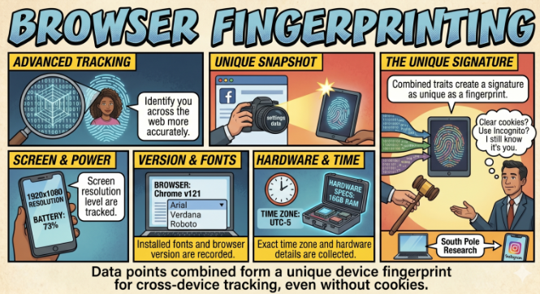
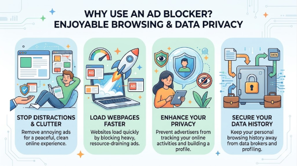

 

# Activity 2: Switch to a "Shielded" Browser

Standard browsers (like Chrome) are designed to facilitate tracking. Switching to a privacy-first browser can stop **Browser Fingerprinting** by default.

If you have any questions or get stuck, please ask the instructor for assistance.

### Browsers

- Open your current web browser and visit a website for a privacy-focused browser such as [**Brave**](https://brave.com/download/){:target="_blank"} or [**Firefox**](https://www.firefox.com/en-CA/){:target="_blank"} (These browsers include built-in protections that “randomize” your fingerprint, making your device look like a generic one instead of a unique target).
- Download and install your preferred browser.

### Must-Have Extensions 
 
- Install an ad blocker extension such as [**uBlock Origin**](https://ublockorigin.com/){:target="_blank"} or [**Privacy Badger**](https://privacybadger.org/){:target="_blank"}
- Install the extension by following the on-screen instructions.

These tools block “trackers” from loading at all, which not only protects your data but also makes your web pages load significantly faster

[NEXT STEP: Downloading Shielded Browser](2-shielded-browser.html){: .btn .btn-blue }
