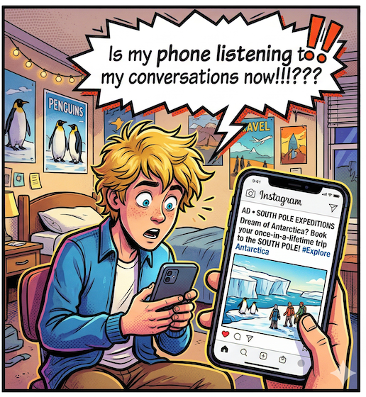

# Is Your Smartphone Listening to You? How Data Brokers Sell Your Digital Footprint & How to Stop It

- Pre-workshop activities: 10 min 
- Introductory presentation: 20 min
- Hands-on activities: 30-50 min

## Why Should I Care?

- **Is Your Phone Listening:** Has something like this happened to you or someone you know? Your friend mentions that you should take a trip to the south pole, and an hour later, there it is, a “South Pole expidition” advertisments showing up as you browse the web… And you didn’t Google anything about the South Pole. So what’s happening here? We will discuss how this really happens and how you can stop it. Spoiler alert: the microphone on your smartphone is NOT lisenting to you.
- **Hacked Account:** Have you ever had someone hack into one of your online accounts? If so you've been Pwned. There are some straight foward solution to this problem that we will review in the workshop.
- **Ads Cluttering & Slowing Down Your Browser**: Ad Blockers...
- **Privacy First Spell & Grammar Checking:** Harper is a free, and privaicy first Grammarly alternative that runs in your laptop browser and does not use and cloud based servers to help you with your spelling and grammar in your web browser.

## Learning objectives - UPDATE FOR THE NEW TOOL

At the end of this workshop, you will be able to:

1. Identify the differences between manual coding and coding with qualitative coding software
3. **MORE OBJECTIVES**
4. [Wikipedia](https://en.wikipedia.org/wiki/Computer-assisted_qualitative_data_analysis_software){:target="_blank"}. 
 
[NEXT STEP: Pre-Workshop Activities](pre-workshop.html){: .btn .btn-blue }
